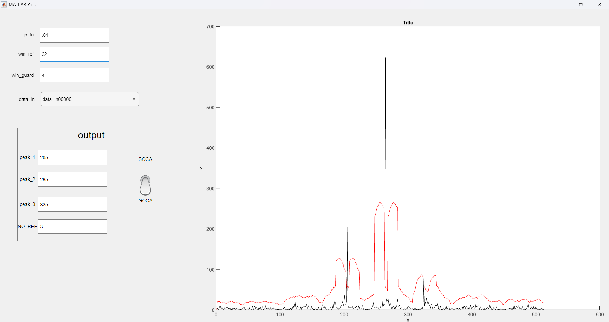
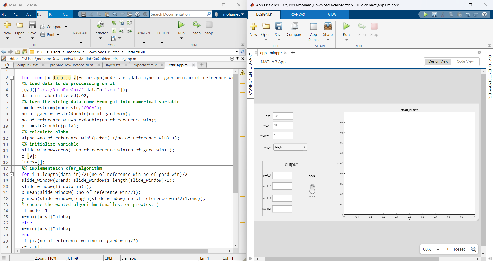
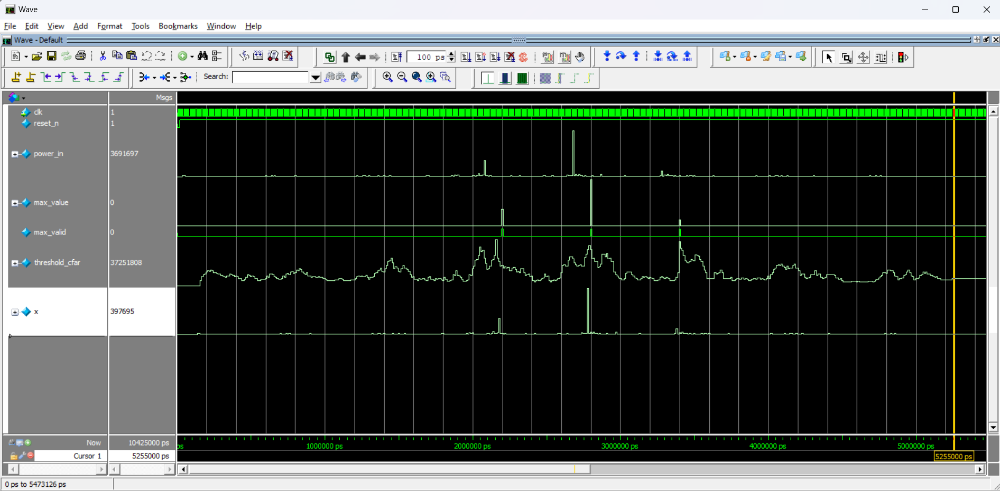
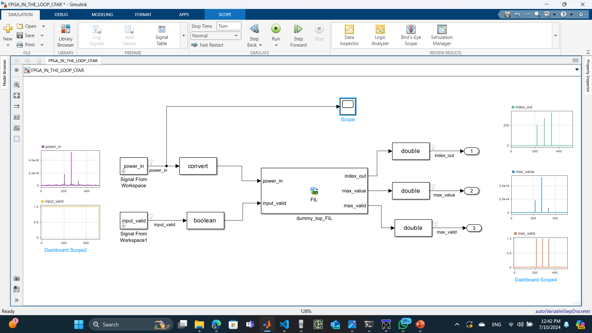

# CFAR Algorithm Project

## Project Overview

This project implements two types of CFAR (Constant False Alarm Rate) algorithms: SOCA (Smallest Of Cell Averaging) and GOCA (Greatest Of Cell Averaging). The project is organized into four main folders, each serving a specific purpose related to the implementation and testing of these algorithms.

## Folder Structure

### 1. DataForGui
- **Description:** Contains the input data required for the MATLAB files.
- **Contents:**
  - `file.mat`: The input data file used by the MATLAB algorithms.

### 2. MatlabGuiGoldenRef
- **Description:** This folder includes the MATLAB implementation of the CFAR algorithm and a GUI app for tuning parameters.
- **Contents:**
  - `app1.mlapp`: The MATLAB GUI application to assist in tuning the CFAR parameters.
  - `cfar_app.m`: The MATLAB file containing the CFAR algorithm, which serves as the golden reference for the project.

### 3. RTL_SV
- **Description:** Contains the HDL files for implementing the SOCA and GOCA algorithms in digital IC design.
- **Contents:**
  - `cfar_algorithm.sv`: The HDL file implementing the CFAR algorithm.
  - `cfar_tb.sv`: The test bench for the CFAR design.
  - `detect_if.sv`: The interface between the DUT (Device Under Test) and the test bench.
  - `top.sv`: The top-level file containing the DUT and test bench.

### 4. Screens
- **Description:** Screenshots of results from various stages of the project.
- **Contents:**
  - `screen_from_gui_GOCA.png`: Screenshot of the running GUI app for GOCA.
    
  - `screen_of_gui_matlab.png`: Screenshot of the MATLAB code and the UI of App Designer.
    
  - `screen_of_rtl.png`: Screenshot of the RTL written in SystemVerilog.
  
- `screen_of_questasim_result.png`: Screenshot of RTL results from simulation in Questasim.

  - `screen_of_simulink_fil.png`: Screenshot of Simulink model used to connect with FPGA.
    
  - `screen_of_command_window.png`: Screenshot of the command window calling Quartus to generate the `.sof` file.
    

### 5. FIL
- **Description:** Contains files for FPGA in the loop (FIL) including the bitstream file and Simulink files.
- **Contents:**
  - `FPGA_IN_THE_LOOP_CFAR.slx`: The Simulink model file for connecting with FPGA.
  - `matlab_script.mlx`: MATLAB script that prepares inputs for Simulink and retrieves results from FPGA.
  - `dummy_top_FIL.fil.sof`: Bitstream file for FPGA.
  - `dummy_top_FIL.sv`: SystemVerilog file used in the FIL process.
  - `for_fpga_in_the_loop.qsf`: Quartus settings file for generating `.sof` file.

## How to Run the Project

### MATLAB GUI
1. Open `file.mat` in MATLAB.
2. Run `cfar_app.m` to execute the CFAR algorithm.
3. Open and run `app1.mlapp` to launch the GUI and tune the CFAR parameters for both SOCA and GOCA.

### HDL Implementation
1. Use a hardware description language simulator such as Questasim.
2. Load the following files from the `RTL_SV` folder:
   - `cfar_algorithm.sv`: The main CFAR algorithm implementation.
   - `cfar_tb.sv`: The test bench for the CFAR algorithm.
   - `detect_if.sv`: The interface between the DUT and the test bench.
   - `top.sv`: The top-level module integrating the DUT and the test bench.
3. Simulate the design and verify the results against the screenshots provided in the `Screens` folder.

### FPGA in the Loop (FIL) Simulation
1. Open the Simulink file in the `FIL` folder to connect with the FPGA 
2. press double click on the fil block then browse on the .sof file and press load and apply.
3. Use the provided MATLAB scripts to prepare inputs for Simulink and running the simulation and retrieve the results from the FPGA.

## Contributing

If you would like to contribute to this project, please fork the repository and use a feature branch. Pull requests are warmly welcome.
